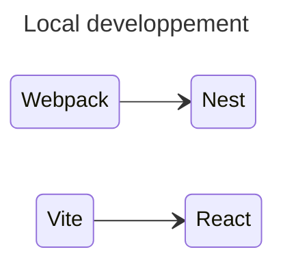
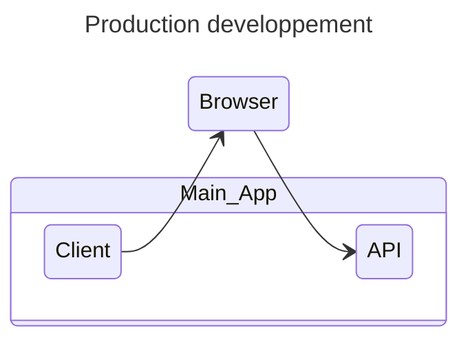

## Dev and Prod 

In local dev we have two different/separate server runin side by side:

In production the operation will be different, there will only be one server. Imagine that we have a build for the client as well as for the API.
The build of the nest application (api) run on node and must be able to serve the client within it

Explication et schema incomplet....

L'application aura son chemin d'accée classique, et l'api sera sur /api sur la meme url.